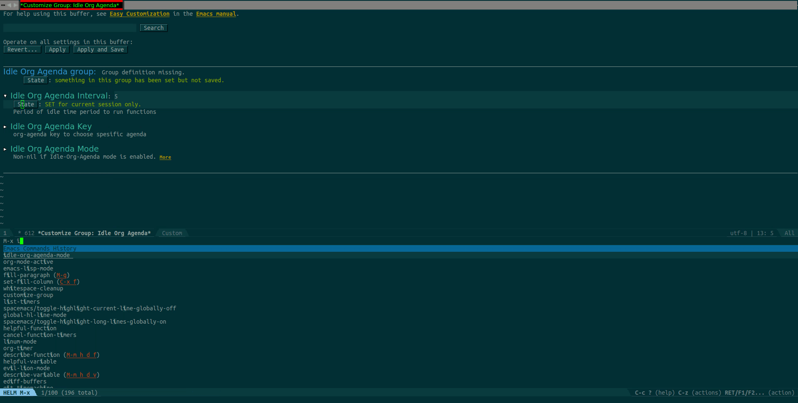

<p align="left"><a href="http://www.gnu.org/licenses/gpl-3.0.txt"></a>
</p>

# `idle-org-agenda`


Basically, if you don't touch Emacs `idle-org-agenda` will display your org-agenda after certain time.
That can be useful to remember tasks after come back to work.

This project is comes from John Wiegley's mail at the gmane mailing list
http://article.gmane.org/gmane.emacs.orgmode/23047


# Installation

  Waiting for Melpa

# How it works



# Additional Configuration

You can define different agendas by using [org-agenda-custom-commands](https://orgmode.org/worg/org-tutorials/org-custom-agenda-commands.html).


```emacs-lisp
(setq org-agenda-custom-commands
   (quote
    (("c" . "Categories")
     ("ce" "Emacs" tags-todo "emacs" nil)
     ("cs" "School" tags-todo "school" nil)
     ("cw" "work" tags-todo "work" nil)
     ("cb" "BLOG" tags-todo "blog" nil)
     ("ci" "Important" tags-todo "important" nil)
     ("w" "Weekly agenda" agenda "You can write here your custom agenda"))))
```


```emacs-lisp
(custom-set-variables
 '(idle-org-agenda-interval 600) ;; 10 x 60 seconds
 '(idle-org-agenda-key "gb")
 '(idle-org-agenda-mode t))
```
